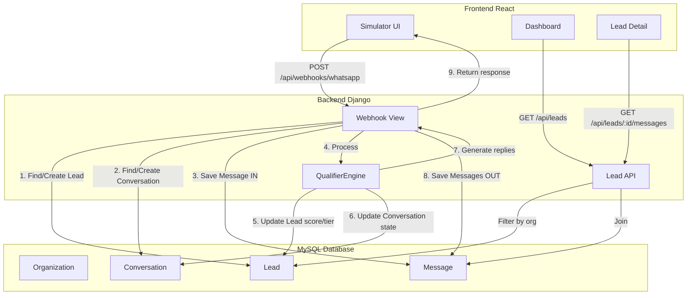

# Plano de Implementação - MVP Lead Qualifier WhatsApp

## 1. Estrutura do Projeto

Criar estrutura de diretórios organizada:

```
border/
├── backend/
│   ├── config/              # Django settings
│   ├── apps/
│   │   ├── core/           # Organization, User extensions
│   │   ├── leads/          # Lead, LeadTag, Note models
│   │   ├── conversations/  # Conversation, Message models
│   │   └── qualifier/      # QualifierEngine (core business logic)
│   ├── api/                # DRF serializers, views, urls
│   ├── manage.py
│   ├── requirements.txt
│   └── README.md
├── frontend/
│   ├── src/
│   │   ├── components/     # Layout, Sidebar, Topbar
│   │   ├── pages/          # Dashboard, LeadsList, LeadDetail, Simulator
│   │   ├── services/       # API client (axios)
│   │   ├── types/          # TypeScript interfaces
│   │   └── App.tsx
│   ├── package.json
│   └── vite.config.ts
└── README.md               # Root README com instruções completas
```

## 2. Backend - Configuração Base

### 2.1 Django Project Setup
- Criar projeto Django `config` com apps modularizadas
- Instalar dependências: `django`, `djangorestframework`, `djangorestframework-simplejwt`, `mysqlclient`, `django-cors-headers`
- Configurar `config/settings.py`:
  - MySQL database connection
  - JWT authentication (SimpleJWT)
  - CORS headers para frontend local
  - Timezone America/Sao_Paulo
  - Logging estruturado

### 2.2 Models - Multi-tenant Ready

**apps/core/models.py:**
- `Organization`: id, name, api_key (UUID), created_at, updated_at
  - Método para validar api_key
  - Index em api_key

**apps/core/user_profile.py:**
- Extend Django User com OneToOne para Organization
- `UserProfile`: user, organization FK

**apps/leads/models.py:**
- `Lead`: todos os campos solicitados com choices bem definidas
  - organization FK (index)
  - phone (unique per organization)
  - instagram_handle (nullable)
  - city, state (CharField 2 para UF)
  - housing_type: choices HOUSE/APT/OTHER
  - daily_time_minutes: IntegerField nullable
  - experience_level: choices FIRST_DOG/HAD_DOGS/HAD_HIGH_ENERGY
  - budget_ok: choices YES/NO/MAYBE
  - timeline: choices NOW/THIRTY_DAYS/SIXTY_PLUS
  - purpose: choices COMPANION/SPORT/WORK
  - has_kids, has_other_pets: BooleanField
  - score: IntegerField default 0
  - tier: CharField choices A/B/C (nullable até qualificar)
  - status: choices NEW/QUALIFYING/QUALIFIED/HANDOFF/CLOSED
  - source: choices INSTAGRAM_AD/ORGANIC/OTHER
  - Timestamps: created_at, updated_at
  - Indexes: organization+status, organization+tier, organization+created_at
  - Meta ordering: ['-created_at']

- `LeadTag`: organization FK, name (unique per org)
- `LeadTagAssignment`: lead FK, tag FK, created_at (unique together)
- `Note`: organization FK, lead FK, author FK User, text, created_at

**apps/conversations/models.py:**
- `Conversation`: 
  - organization FK, lead FK (OneToOne or FK)
  - channel: choices WHATSAPP/SIMULATED
  - state: CharField (STATE_INITIAL, STATE_Q1_LOCATION, STATE_Q2_HOUSING, etc.)
  - last_message_at, created_at, updated_at
  - Index: organization+lead

- `Message`:
  - organization FK, conversation FK
  - direction: choices IN/OUT
  - text: TextField
  - provider_message_id: nullable
  - created_at
  - Index: conversation+created_at
  - Meta ordering: ['created_at']

### 2.3 Migrations
- Criar migrations para todos os models
- Migration inicial deve ter Organization default e tags base

## 3. Backend - Qualifier Engine (Core Logic)

**apps/qualifier/engine.py:**

Implementar `QualifierEngine` como classe stateless com métodos:

```python
class QualifierEngine:
    def process_message(self, conversation, inbound_text):
        """
        Main entry point
        Returns: (outbound_messages: list[str], updated_lead: Lead)
        """
        
    def _determine_next_state(self, current_state, parsed_data):
        """State machine logic"""
        
    def _calculate_score(self, lead):
        """Score calculation with documented rules"""
        
    def _determine_tier(self, score):
        """Tier assignment A/B/C"""
        
    def _generate_auto_tags(self, lead):
        """Auto tag generation"""
```

**apps/qualifier/parsers.py:**
Funções helper isoladas e testáveis:
- `extract_uf(text)`: regex para UF brasileiro
- `parse_time_minutes(text)`: extrair tempo de "1h", "90min", "duas horas"
- `infer_housing_type(text)`: casa/apt/outro
- `infer_boolean(text, keyword)`: kids, pets via keywords
- `infer_budget_response(text)`: yes/no/maybe
- `infer_timeline(text)`: now/30/60+
- `infer_purpose(text)`: companion/sport/work

**apps/qualifier/states.py:**
Constantes de estado e mensagens base:
```python
STATE_INITIAL = 'INITIAL'
STATE_Q1_LOCATION = 'Q1_LOCATION'
STATE_Q2_HOUSING = 'Q2_HOUSING'
# ... até STATE_COMPLETE

MESSAGES = {
    'INITIAL': '🐶 Oi! Obrigado pelo interesse...',
    'Q1_LOCATION': '📍 Qual cidade/UF você está?',
    # ...
}
```

**Regras de Score (comentadas no código):**
- budget_ok YES: +30, MAYBE: +10, NO: tier C imediato
- housing HOUSE: +15, APT com time>=60: +5, APT com time<60: -10
- daily_time: >=60: +20, 30-59: +10, <30: -10
- experience: HAD_HIGH_ENERGY: +15, HAD_DOGS: +8, FIRST_DOG: -5
- timeline: NOW: +10, THIRTY_DAYS: +5, SIXTY_PLUS: 0
- purpose: SPORT/WORK: +10, COMPANION: +5

**Thresholds:**
- Tier A: score >= 70
- Tier B: 40-69
- Tier C: <40 ou budget_ok NO

## 4. Backend - API Endpoints

**api/urls.py:**
```
/api/auth/register
/api/auth/login
/api/auth/refresh
/api/leads/
/api/leads/:id/
/api/leads/:id/messages/
/api/conversations/
/api/conversations/:id/
/api/webhooks/whatsapp/
```

**api/views/**

`auth_views.py`:
- RegisterView: cria User + Organization default se não existir
- LoginView: JWT com SimpleJWT
- RefreshView: refresh token

`lead_views.py` (DRF ViewSets):
- LeadViewSet: list, retrieve, partial_update
  - Filtros: tier, status, city, source (django-filter)
  - Sempre filtrado por request.user.profile.organization
  - Action extra: `messages` retorna mensagens da conversa

`conversation_views.py`:
- ConversationViewSet: list, retrieve (read-only)

`webhook_views.py`:
- WhatsAppWebhookView (APIView):
  - POST: recebe {organization_id, from_phone, text, provider}
  - Valida organization via X-ORG-KEY header
  - Cria/atualiza Lead, Conversation, Message IN
  - Chama QualifierEngine.process_message()
  - Salva Messages OUT
  - Retorna {replies, lead: {id, tier, score, state}}

**api/serializers.py:**
- LeadSerializer, LeadListSerializer (lightweight)
- MessageSerializer
- ConversationSerializer
- NoteSerializer

**api/permissions.py:**
- IsOrganizationMember: verifica que user pertence à org do objeto

## 5. Backend - Management Commands

**apps/core/management/commands/seed.py:**
```
python manage.py seed
```
Cria:
- Organization "Border Collie Sul" com api_key
- User admin (email: admin@bordercollie.com, senha: admin123)
- Tags padrão: APTO_OK, TIME_LOW, BUDGET_OK, FIRST_DOG, NOW, SPORT, WORK, HAS_KIDS, HAS_PETS
- 2-3 leads de exemplo com conversas

## 6. Backend - Testes

**apps/qualifier/tests/test_engine.py:**

Mínimo 6 testes unitários:
1. `test_initial_message`: verifica primeira interação
2. `test_location_parsing`: testa extração de UF
3. `test_housing_and_time_scoring`: valida score casa vs apto
4. `test_budget_no_triggers_tier_c`: budget NO = tier C imediato
5. `test_full_flow_tier_a`: simula conversa completa para tier A
6. `test_full_flow_tier_b`: simula conversa completa para tier B

Usar pytest ou unittest do Django.

## 7. Frontend - Setup React + Vite

**package.json:**
- react, react-dom
- react-router-dom
- axios
- bootstrap@5 (via CDN no index.html)
- bootstrap-icons (via CDN)
- TypeScript

**vite.config.ts:**
- Proxy para backend: `/api -> http://localhost:8000`

**index.html:**
```html
<link href="https://cdn.jsdelivr.net/npm/bootstrap@5.3.0/dist/css/bootstrap.min.css" rel="stylesheet">
<link href="https://cdn.jsdelivr.net/npm/bootstrap-icons@1.11.0/font/bootstrap-icons.css" rel="stylesheet">
```

## 8. Frontend - Estrutura e Layout

**src/components/Layout.tsx:**
- Sidebar vertical fixa (250px):
  - Logo no topo
  - Menu: Dashboard, Leads, Simulador
  - User info no rodapé
- Topbar:
  - Breadcrumb ou título da página
  - User dropdown com Logout
- Content wrapper: `<main>` com padding

**src/components/Sidebar.tsx:**
- Links com ícones Bootstrap Icons
- Ativo destacado

**src/components/Topbar.tsx:**
- Barra horizontal com user avatar/nome
- Botão logout

## 9. Frontend - Páginas

### 9.1 Login.tsx
- Form centralizado
- Email + senha
- Chama `/api/auth/login`
- Salva JWT no localStorage
- Redirect para Dashboard

### 9.2 Dashboard.tsx
- Grid de 4 cards KPI:
  - Total Leads
  - Tier A (badge verde)
  - Tier B (badge amarelo)
  - Tier C (badge vermelho)
- Gráfico simples ou lista dos últimos 10 leads
- Cards com ícones (bi-people, bi-star, bi-trophy)

### 9.3 LeadsList.tsx
- Tabela Bootstrap com:
  - Colunas: Nome/Telefone, Cidade, Tier (badge), Score, Status (badge), Data
  - Filtros: tier, status (dropdowns)
  - Paginação básica
- Clique na row abre LeadDetail

### 9.4 LeadDetail.tsx
- Layout 2 colunas (info + conversa):
  - **Coluna esquerda (40%):**
    - Card com dados do lead
    - Tags (badges)
    - Score/Tier
    - Botão "Marcar como HANDOFF"
    - Seção de notas (lista + form para adicionar)
  - **Coluna direita (60%):**
    - Chat-style messages (IN vs OUT com cores diferentes)
    - Scroll automático para última mensagem

### 9.5 Simulator.tsx
- Card com form:
  - Input: Telefone (tel format)
  - Textarea: Mensagem
  - Botão "Enviar"
- Ao enviar:
  - POST `/api/webhooks/whatsapp` com organization_id e X-ORG-KEY
  - Mostra replies em alert ou card
  - Opção: abrir modal com conversa atualizada

## 10. Frontend - Services

**src/services/api.ts:**
```typescript
import axios from 'axios';

const api = axios.create({
  baseURL: '/api',
});

// Interceptor para adicionar JWT
api.interceptors.request.use(config => {
  const token = localStorage.getItem('token');
  if (token) {
    config.headers.Authorization = `Bearer ${token}`;
  }
  return config;
});

export default api;
```

**src/services/auth.ts:**
- login(email, password)
- logout()
- getCurrentUser()

**src/services/leads.ts:**
- getLeads(filters)
- getLead(id)
- updateLead(id, data)
- getLeadMessages(id)

**src/services/simulator.ts:**
- sendSimulatedMessage(phone, text, orgKey)

## 11. Frontend - Types

**src/types/index.ts:**
```typescript
export interface Lead {
  id: number;
  phone: string;
  city?: string;
  state?: string;
  score: number;
  tier?: 'A' | 'B' | 'C';
  status: string;
  housing_type?: string;
  // ... outros campos
  created_at: string;
}

export interface Message {
  id: number;
  direction: 'IN' | 'OUT';
  text: string;
  created_at: string;
}

// ... outros tipos
```

## 12. Styling - CSS Customizado

**src/styles/app.css:**
- Variáveis CSS para cores premium (azul/verde)
- Override Bootstrap para tema mais clean
- Sidebar fixed positioning
- Chat bubble styles
- Badge colors para tiers (A=success, B=warning, C=danger)

## 13. Configuração e Documentação

### 13.1 backend/config/settings.py
Arquivo com defaults sensíveis e imports de variáveis de ambiente opcionais:
```python
import os

DATABASES = {
    'default': {
        'ENGINE': 'django.db.backends.mysql',
        'NAME': os.getenv('DB_NAME', 'border_leads'),
        'USER': os.getenv('DB_USER', 'root'),
        'PASSWORD': os.getenv('DB_PASSWORD', ''),
        'HOST': os.getenv('DB_HOST', 'localhost'),
        'PORT': os.getenv('DB_PORT', '3306'),
    }
}

SECRET_KEY = os.getenv('SECRET_KEY', 'dev-secret-key-change-in-production')
```

### 13.2 README.md (Root)
Seções:
- **Sobre o Projeto**
- **Stack Tecnológica**
- **Pré-requisitos**: Python 3.12, Node 18+, MySQL 8
- **Setup Backend:**
  ```bash
  cd backend
  python -m venv venv
  source venv/bin/activate
  pip install -r requirements.txt
  # Criar database no MySQL
  python manage.py migrate
  python manage.py seed
  python manage.py runserver
  ```
- **Setup Frontend:**
  ```bash
  cd frontend
  npm install
  npm run dev
  ```
- **Credenciais Default:**
  - Email: admin@bordercollie.com
  - Senha: admin123
  - Organization API Key: (impresso no seed)
- **Endpoints API** (lista completa)
- **Testando o Simulador**: exemplo de payload para webhook
- **Próximos Passos**: integração WhatsApp Cloud API

### 13.3 backend/README.md
Detalhes técnicos:
- Estrutura de apps
- Como funciona o QualifierEngine
- Regras de score detalhadas
- Como adicionar novas perguntas
- Rodar testes: `pytest apps/qualifier/tests/`

## 14. Refinamentos Finais

### 14.1 Segurança
- CORS configurado apenas para localhost frontend
- JWT expiration: 24h access, 7 dias refresh
- Organization API key validado em webhook
- Queryset filtering por organization em todos os endpoints

### 14.2 UX Premium
- Loading states nos botões
- Toasts para feedback de ações (sucesso/erro)
- Empty states nas listas
- Responsivo mobile-friendly
- Transições suaves

### 14.3 Logging
- Logger configurado para salvar em arquivo
- Log de cada mensagem processada pelo engine
- Log de erros de API

### 14.4 Validações
- Validators customizados para phone format brasileiro
- Validação de UF na lista oficial
- Limites de texto em notas e mensagens

## Fluxo de Dados Completo



## Arquivos Principais a Criar

Total estimado: ~45 arquivos

**Backend (25 arquivos):**
- config/settings.py, urls.py, wsgi.py
- apps/core: models.py, admin.py, management/commands/seed.py
- apps/leads: models.py, admin.py
- apps/conversations: models.py, admin.py
- apps/qualifier: engine.py, parsers.py, states.py, tests/test_engine.py
- api: serializers.py, permissions.py, urls.py
- api/views: auth_views.py, lead_views.py, conversation_views.py, webhook_views.py
- requirements.txt
- manage.py
- README.md

**Frontend (20 arquivos):**
- src/App.tsx, main.tsx
- src/components: Layout.tsx, Sidebar.tsx, Topbar.tsx, PrivateRoute.tsx
- src/pages: Login.tsx, Dashboard.tsx, LeadsList.tsx, LeadDetail.tsx, Simulator.tsx
- src/services: api.ts, auth.ts, leads.ts, simulator.ts
- src/types: index.ts
- src/styles: app.css
- index.html
- vite.config.ts
- tsconfig.json
- package.json
- README.md

**Root:**
- README.md principal
